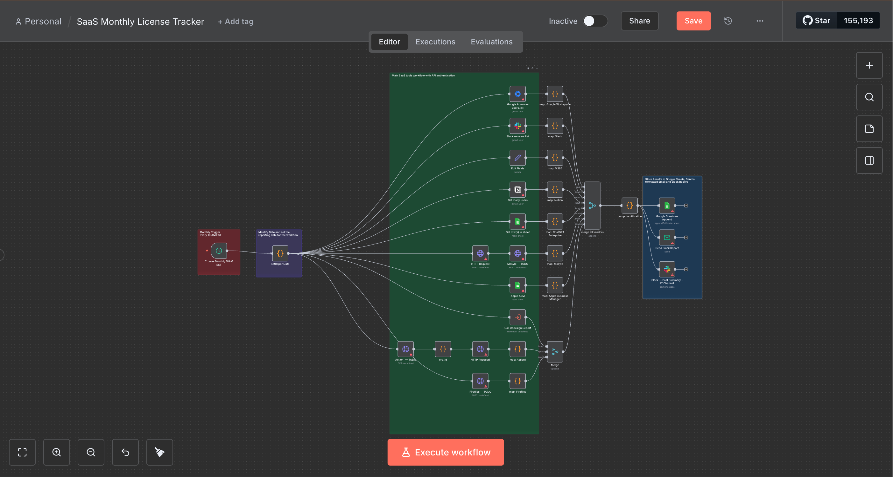
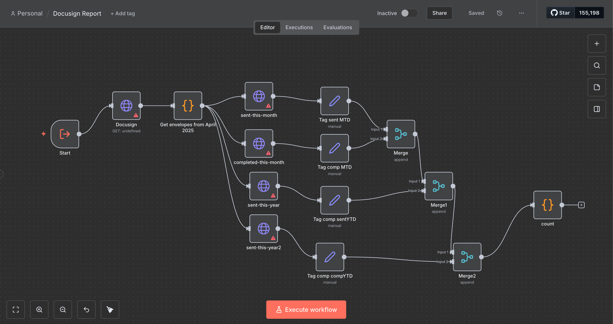
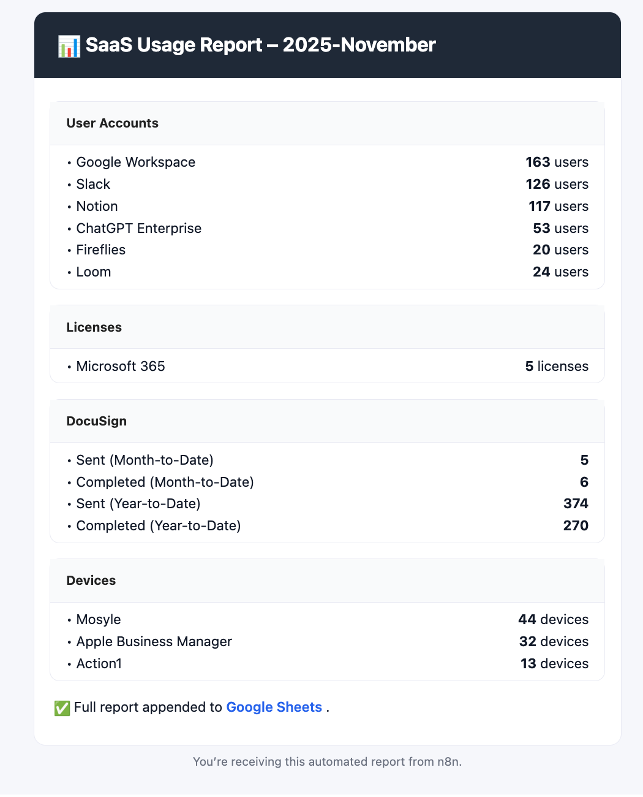
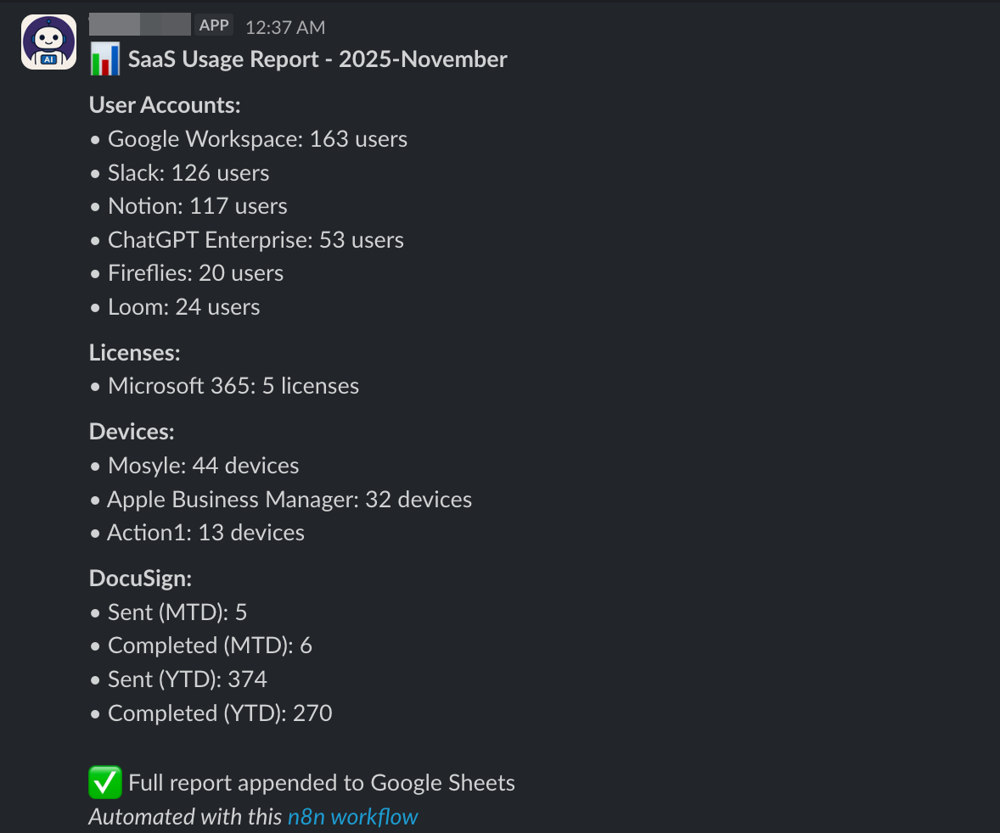

# SaaS Monthly License Tracker

**Automate your SaaS license tracking in minutes instead of hours using N8n.**

## The Problem

Every month, your IT team spends **4-5 hours** manually gathering license data:
- Logging into 10+ different admin portals
- Copying user counts from each platform
- Manually entering data into spreadsheets
- Formatting reports for stakeholders
- Sending updates via email and Slack

**What if this entire process ran automatically while you focused on more strategic work?**

## The Solution

This n8n workflow automates your entire SaaS license tracking pipeline. Set it up once, and on the 1st of every month at 10:00 AM, it automatically:

✅ **Collects** license data from all your platforms simultaneously  
✅ **Consolidates** everything into a single report  
✅ **Updates** your tracking spreadsheet  
✅ **Sends** formatted email reports to stakeholders  
✅ **Posts** summary updates to your Slack channel  

**Time saved: 4-5 hours per month → 48-60 hours per year**

## What It Tracks

### User Account Platforms
- Google Workspace
- Slack
- Microsoft 365
- Notion
- ChatGPT Enterprise
- Fireflies

### Device Management
- Mosyle
- Apple Business Manager
- Action1

### Document Services
- DocuSign (envelopes sent/completed - MTD & YTD)

---

## Quick Start

### 1. Import the Workflow
1. Download `SaaS_Monthly_License_Tracker.json` and `Docusign_Report.json`
2. In n8n: **Workflows → Import from File**
3. Select the file and click **Import**

### 2. Configure Credentials

Set up credentials for each platform you use. The workflow uses n8n's built-in credential types:

| Platform | Credential Type | Required Access |
|----------|----------------|-----------------|
| Google Workspace | OAuth2 | Admin SDK API (user.readonly) |
| Google Sheets | OAuth2 | Spreadsheets API |
| Slack | API Token | users:read scope |
| Notion | API Key | Internal Integration |
| Mosyle | Header Auth | API Key (Bearer) |
| Apple ABM | Header Auth | API Key (Bearer) |
| Action1 | OAuth2 | Standard OAuth flow |
| Fireflies | Bearer Auth | API Key |
| Email | SMTP | Standard SMTP credentials |

**Don't use all these platforms?** Simply disable the nodes you don't need.

### 3. Set Environment Variables

Configure these in your n8n settings:
```bash
# Main Google Sheet
GOOGLE_SHEET_ID=your_sheet_id
SHEET_NAME=License_Tracking

# Data Source Sheets
M365_USAGE_SHEET_ID=your_m365_sheet_id
M365_USAGE_SHEET_NAME=M365_Users
CHATGPT_USAGE_SHEET_ID=your_chatgpt_sheet_id
CHATGPT_USAGE_SHEET_NAME=Usage

# API Configuration
MOSYLE_API_KEY=Bearer_your_key
APPLE_ABM_API_URL=https://your-endpoint.com/graphql

# Communication
EMAIL_FROM=reports@company.com
EMAIL_TO=it-team@company.com
SLACK_CHANNEL_ID=C0123ABCDEF

# Sub-Workflows
DOCUSIGN_WORKFLOW_ID=your_docusign_workflow_id
```

### 4. Prepare Your Google Sheet

Create a sheet with these column headers:
```
Report Date | Google Workspace Users | Slack Users | Microsoft 365 Licenses | 
Notion Users | ChatGPT Users | Mosyle Devices | Apple ABM Devices | 
Action1 Devices | Fireflies Users | DocuSign Sent (MTD) | 
DocuSign Completed (MTD) | DocuSign Sent (YTD) | DocuSign Completed (YTD)
```

### 5. Test & Activate

1. Click **Execute Workflow** to test
2. Verify data appears in your sheet
3. Check email and Slack outputs
4. Toggle **Active** to enable monthly automation

---

## How It Works
```
Monthly Trigger (1st @ 10AM EST)
    ↓
Parallel Data Collection from All Platforms
    ↓
Data Normalization & Consolidation
    ↓
┌─────────────────────┬─────────────────────┬─────────────────────┐
│  Google Sheets      │  Email Report       │  Slack Summary      │
│  (Append new row)   │  (Formatted table)  │  (Quick stats)      │
└─────────────────────┴─────────────────────┴─────────────────────┘
```

The workflow runs in parallel, querying all platforms simultaneously for maximum efficiency.

---

## Workflow Screenshots

### Main Workflow


### DocuSign Sub-Workflow


### Email Report Output


### Slack Report Output


## Customization

### Add a New Platform

1. **Add API node** → Configure authentication → Connect to "Merge All Vendors"
2. **Add mapping node** → Transform data to standard format
3. **Update compute node** → Include new platform in calculations
4. **Update outputs** → Add column to sheet, email, and Slack templates

**Example**: Adding Zoom
```javascript
// In "Compute Utilization" node
'Zoom Users': combined['Zoom'] || 0,
```

### Remove a Platform

1. Delete or disable the platform's nodes
2. Remove from merge node inputs
3. Update compute node to exclude platform
4. Remove from output templates

### Change Schedule

Edit the cron trigger node:
- **Weekly**: `0 10 * * 1` (Mondays at 10 AM)
- **Bi-weekly**: `0 10 1,15 * *` (1st & 15th at 10 AM)
- **Quarterly**: `0 10 1 1,4,7,10 *` (First day of Q1,Q2,Q3,Q4)

---

## Future Enhancements

This is a continuously improving workflow. Planned features:

### 🤖 AI-Powered Insights
- **Smart Summaries**: AI-generated executive summaries highlighting key trends
- **Anomaly Detection**: Automatic alerts for unusual license usage patterns
- **Cost Optimization**: AI recommendations for license consolidation
- **Predictive Analytics**: Forecast future license needs based on growth patterns

### 📊 Advanced Reporting
- **Trend Analysis**: Month-over-month and year-over-year comparisons
- **Cost Tracking**: Link license counts to pricing data for budget analysis
- **Utilization Heatmaps**: Visual representation of platform adoption
- **Custom Dashboards**: Interactive Tableau/Power BI integration

### 🔧 Additional Integrations
- **Loom**
- **ChatGPT** - API instead of manual
- - **Apple Business Manager** - API integration

### 🚨 Proactive Monitoring
- **Threshold Alerts**: Notify when approaching license limits
- **Unused License Detection**: Identify inactive accounts for optimization
- **Renewal Reminders**: Track contract end dates and send advance notices
- **Compliance Reporting**: Automated audit trail for license compliance

**Have ideas?** Open to suggestions! Submit feature requests via GitHub Issues.

---

## Troubleshooting

| Issue | Solution |
|-------|----------|
| **Authentication fails** | Regenerate OAuth tokens; verify API key validity |
| **Missing data** | Check environment variables; review node execution logs |
| **Sheet errors** | Confirm sheet ID and column headers match configuration |
| **Email not sending** | Verify SMTP credentials and sender authorization |
| **Slack fails** | Ensure bot token has correct permissions and channel access |

**Enable debug mode**: Settings → Workflow Settings → Save all execution data

---

## Best Practices

- **Test in sandbox** before production deployment
- **Start simple** - enable only platforms you actively use
- **Review monthly** - spot-check data accuracy for the first 3 months
- **Rotate credentials** quarterly for security
- **Document customizations** for team knowledge sharing

---

## License

MIT License - Free to use, modify, and distribute.

---

## Why This Matters

IT teams are often buried in repetitive administrative tasks. Every hour spent manually gathering license data is an hour not spent on:
- Improving security posture
- Optimizing infrastructure
- Supporting end users
- Driving digital transformation

**This workflow gives you that time back.**

Set it up once. Save 4-5 hours every single month. Focus on what matters.
